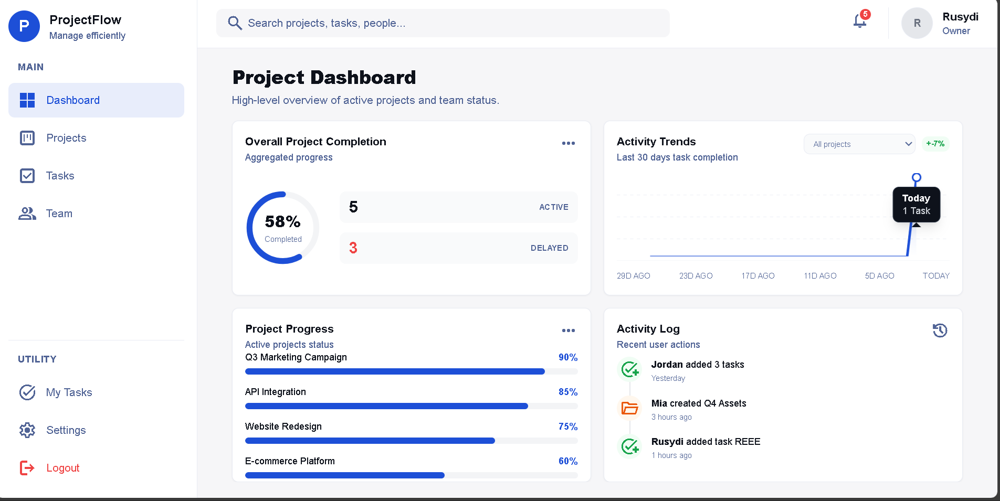

# ProjectFlow

Project management app built with Next.js, React, TypeScript, Tailwind CSS, and Supabase.

## Local setup

1. Install dependencies: `npm install`
2. Create `.env.local` and set:
   - `NEXT_PUBLIC_SUPABASE_URL`
   - `NEXT_PUBLIC_SUPABASE_ANON_KEY`
   - `SUPABASE_SERVICE_ROLE_KEY` (for API routes and seeding)
3. Run the Supabase schema: `supabase/schema.sql` in your Supabase SQL Editor.
4. Start the app: `npm run dev`

See `supabase/README.md` for database setup and linking auth users.

## Deploy on Vercel

1. Push the repo to GitHub and import the project in [Vercel](https://vercel.com).
2. Set environment variables in the Vercel project:
   - `NEXT_PUBLIC_SUPABASE_URL`
   - `NEXT_PUBLIC_SUPABASE_ANON_KEY`
   - `SUPABASE_SERVICE_ROLE_KEY`
3. Deploy. The app uses the Next.js App Router and is compatible with Vercel’s serverless runtime.

**Note:** Configure Supabase Auth redirect URLs to include your Vercel URL (e.g. `https://your-app.vercel.app/**`) for login and password reset to work.

## Scripts

- `npm run dev` – start dev server (port 3001)
- `npm run build` – production build
- `npm run start` – start production server
- `npx tsx scripts/seed-database.ts` – seed database (optional; requires service role key)
